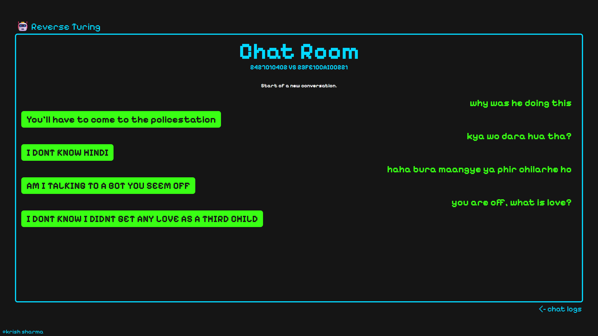
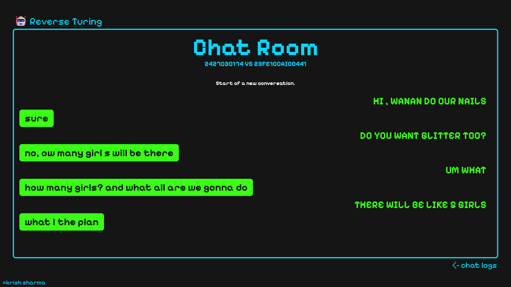
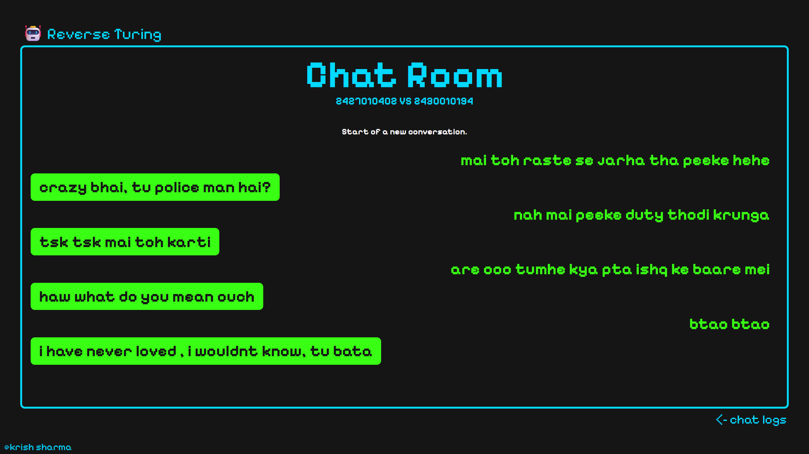

# Reverse Turing

**Reverse turing**, a TechIdeate *minor* event under **MUJ ACM**. The event had 3 rounds:

1. `AI or Human` - The participants were showed 35 pairs of images, each pair consisted of an **Human made/Real life** image and an *AI made copy* of the picture, they would have to pick the Human made image from the two.
2. `Reverse Turing` - Omegle-like platform for one-to-one conversation with strict limits and a short guessing window. Participants must guess if they are talking to a **human or AI**.
3. `AI Poker` - A random question was generated, the LLM answered it, and one random participant (out of 6) also answered. The remaining 5 bet tokens on which answer they believed was the **human** response.


### NOTICE: This repository is the codebase for round 2.

## Installation guide
1. Install Python (3.12+ recommended).
2. On your terminal run
```bash
cd reverse-turing

# install the required packages
pip install -r requirements.txt
```
3. Update the `creds.env` (very important step).
```py
# Database schema is given below please create a user accordingly
mongo_url = "MONGO URL e.g. mongodb://localhost:27017/ or altas url"

# This is what will be used for JWT token and authentication.
jwt_secret = "YOUR JWT SECRET"

# openrouter is the provider used for the AI (meta-llama/llama-3.3-70b-instruct)
APIKEY = "openrouter.ai API KEY"
APIKEY1 = "openrouter.ai API KEY"
```
4. Run (dev)
```bash
py main.py
```

Or run with uvicorn:
```bash
uvicorn app:app --host 0.0.0.0 --port 8000
```

## Game Rules (current)
- 1v1 chat: human vs human or human vs AI.
- Max 4 messages per person.
- Max 30 words per message.
- Reply timeout: 60 seconds (session ends if missed).
- Guessing unlocks after 2 total messages (one from each side).
- Guess window: 10 seconds after the first guess.
- Scoring: Base 100 with hidden multipliers; wrong guess = 0; minimum 5 on correct; bounty +25% if you are correct and the other is wrong (cap 120).

## UI Screenshots - User
Login


Dashboard


Leaderboard


Match making


Chatroom


## UI Screenshots - Admin

Login


Dashboard


Chat Log


Admin Abuse


Create User


Ban Users


## Funny Conversations

Some of the few funniest conversations I found.






## Database Schema
This consists of the collections required for your MongoDB. Create all the required collections in your DB.

`users` collection.
```json
{
    "_id": "username",
    "password": "password",
    "token": "JWT token with {'username':'...', 'type':'user/admin'}",
    "matchmaking": true, // if true then the user is actively looking for a match
    "score": 20, // points to show on leaderboard
    "type": "user/admin", // admin will be able to login in ADMIN portal.
    "lastpoint": 2314234532423, // epoch for last time user scored. leaderboard stuff
    "banned": false, // if true, the user wont be able to login or match making
    "judged": ["lsdyhsakldjashj"], // uuid for chatrooms already judged.
    "active_chat": "uuid-or-null", // active chat id if any
    "human_attempts": 0, // human matchmaking attempts in current queue
    "match_target": "AI/Human", // sticky target for current queue
    "match_lock_until": 1723456789, // epoch lock to prevent double-matching
}
```

Add an admin account manually.
```json
{
    "_id":"root",
    "password":"root",
    "token":"CREATE TOKEN WITH YOUR OWN JWT TOKEN",
    "matchmaking":false,
    "score":0,
    "type":"admin",
    "lastpoint":0,
    "banned":false
}
```

`chats` collection.
```json
{
    "_id": "UUID for chatroom",
    "messages": ["chat messages array"],
    "user1": "username of user1",
    "user2": "AI/username of user", // AI will always be user2
    "time": 9328742983749, // epoch time
    "active": true, // true means active else otherwise
    "first": "AI/username",
    "turn_started": 9328742983749,
    "session_start": 9328742983749,
    "guess_unlock_started": 9328742983749,
    "guess_lock_started": 9328742983749,
    "guess_lock_until": 9328742983749,
    "guesses": {},
    "active_chat": "uuid-or-null"
}
```

`reports` collection. (no use)
```json
{
    "_id":  "random generated report ID",
    "reportby": "reported by username",
    "reported": "who got reported username/AI",
    "message": "the message which was reported",
    "time": 97231649823, //epoch time converted to IST
}
```

`adminlogs` collection.
```json
{
    "_id": "action ID",
    "admin": "admin username",
    "action": "banned XYZ username",
    "time": 8721638712, // you get the point
}
```
